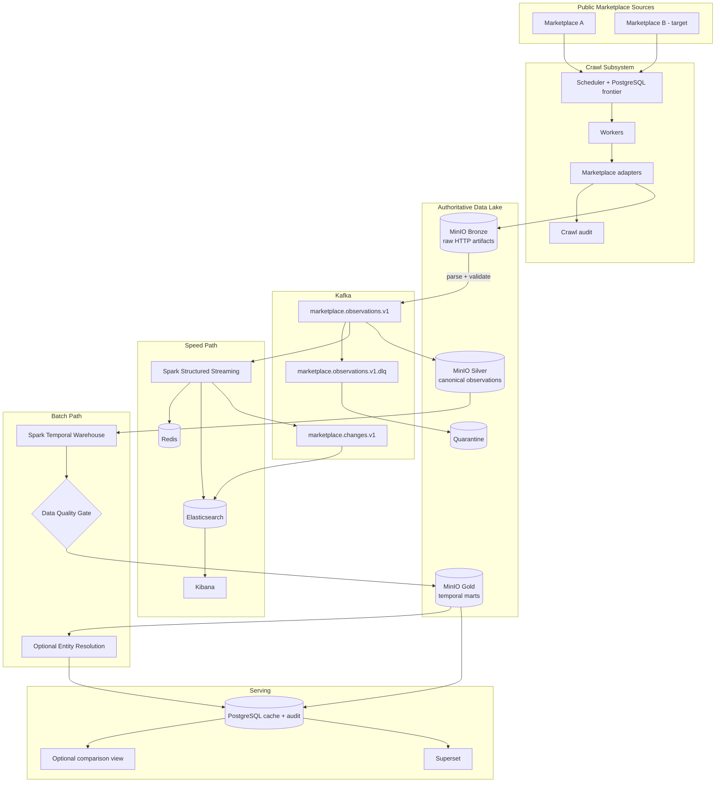

# Kế hoạch chi tiết cải tiến `ecommerce-lambda-architecture`

> Trạng thái: **Scope lock định hướng crawler-first cho DATN 3 tháng**
>
> Core: **Continuous Marketplace Data Acquisition + Lambda Temporal Analytics**
>
> Optional cuối kỳ: **Cross-marketplace Product Matching and Comparison**

---

## 1. Quyết định cuối cùng

Project chuyển nguồn dữ liệu chính từ Kaggle historical behavioral events sang
dữ liệu public marketplace do hệ thống crawler tự thu thập liên tục.

Linh hồn project vẫn là Big Data và Lambda Architecture, nhưng đơn vị dữ liệu
được thay đổi từ behavioral event:

```text
(user, session, product, view/cart/purchase, timestamp)
```

thành temporal marketplace observation:

```text
(marketplace, listing, seller, observed_at)
-> price, rating, counters, availability và public metadata
```

Hệ thống không cố tái tạo `view`, `cart`, `purchase`, user session hoặc exact
transactions từ dữ liệu public.

### Vai trò các nguồn dữ liệu

- **Crawler observations**: nguồn dữ liệu chính của luận văn, dùng cho toàn bộ
  kết quả phân tích và đánh giá pipeline mới.
- **Kaggle dataset cũ**: legacy workload; có thể giữ để regression hoặc benchmark
  kỹ thuật, nhưng không còn là dữ liệu chính và không dùng để chứng minh real acquisition.
- **Generated benchmark workload**: chỉ dùng đo hiệu năng, phải được ghi nhãn rõ,
  không trộn vào analytical results.

### Product comparison

Product matching và comparison không phải điều kiện hoàn thành core MVP. Trong
giai đoạn đầu, hệ thống tập trung thu thập, lưu trữ, chuẩn hóa và phân tích biến
động theo thời gian ở cấp marketplace offer. Matching giữa các marketplace chỉ
được triển khai ở phase cuối nếu core pipeline đã ổn định.

---

## 2. Thesis positioning

### Tên tiếng Việt đề xuất

**Xây dựng nền tảng dữ liệu lớn thu thập liên tục và phân tích biến động sản phẩm thương mại điện tử theo kiến trúc Lambda**

Tên này không phụ thuộc việc source thứ hai hoặc cross-market matching có hoàn
thành hay không.

### Tên tiếng Anh đề xuất

**A Lambda-Based Big Data Platform for Continuous E-commerce Product Data Acquisition and Temporal Analytics**

### Câu hỏi nghiên cứu chính

> Làm thế nào xây dựng một nền tảng dữ liệu lớn có khả năng thu thập liên tục,
> chuẩn hóa, lưu trữ và phân tích các quan sát sản phẩm thương mại điện tử biến
> động theo thời gian, đồng thời bảo đảm provenance, freshness, idempotency và
> khả năng tái xử lý?

### Các câu hỏi phụ

1. Làm thế nào cô lập logic đặc thù của từng marketplace khỏi canonical data model?
2. Làm thế nào lưu raw responses để thích ứng với parser bug và source schema drift?
3. Làm thế nào phát hiện thay đổi gần realtime trong khi vẫn có batch truth chính xác?
4. Làm thế nào đo freshness, data quality, crawl reliability và pipeline performance?
5. Public counters có thể tạo ra temporal proxy nào mà không bị diễn giải thành ground truth?

### Đóng góp dự kiến

1. Multi-source crawler architecture có raw preservation và provenance.
2. Versioned canonical marketplace-observation contract.
3. Lambda processing cho change detection và batch temporal analytics.
4. Data-quality, idempotency, replay và schema-drift handling.
5. Đánh giá throughput, latency, freshness và crawl reliability trên dữ liệu tự thu thập.

---

## 3. Feasibility gate bắt buộc trong tuần đầu

Không khóa marketplace dựa trên giả định. Trong 5–7 ngày đầu phải thử tối đa ba
source candidates và chọn source chính dựa trên bằng chứng.

### Mỗi source candidate phải được kiểm tra

- Khả năng truy cập public pages/endpoints một cách hợp lệ.
- Robots/source constraints và crawl budget.
- Listing ID có ổn định qua nhiều lần crawl hay không.
- Có lấy được title, URL, current price và timestamp hay không.
- Pagination và category discovery có hoạt động hay không.
- Response size, latency và error/status distribution.
- Field stability qua nhiều lần chạy trong 24–48 giờ.
- Có đủ số listing để tạo monitored universe.
- Nếu dự kiến comparison: mức overlap sản phẩm với source khác.

### Quyết định cuối tuần 1

- Chọn **một source chính bắt buộc**.
- Chọn **một source thứ hai** nếu feasibility đạt và không cần anti-bot bypass phức tạp.
- Chọn một category hoặc một nhóm category hẹp.
- Chốt target offers, crawl cadence và projected volume.
- Không thay domain hoặc source chính sau tuần 1, trừ khi source dừng hoạt động hoàn toàn.

Nếu chỉ một source đạt, luận văn vẫn tiếp tục theo Temporal Marketplace Product
Analytics; không dùng cụm “cross-marketplace” trong title hoặc core claims.

---

## 4. Scope lock

### 4.1 Core MVP bắt buộc

- Ít nhất một marketplace adapter chạy ổn định.
- Một monitored universe có giới hạn và cấu hình rõ.
- Continuous scheduled crawling trong tối thiểu 30 ngày; mục tiêu 45–60 ngày.
- Raw response được lưu vào MinIO Bronze trước khi parse.
- Canonical offer observations được ghi vào Kafka và MinIO Silver.
- Quarantine và DLQ cho fetch/parse/validation failures.
- Deterministic IDs và idempotent replay.
- Spark Structured Streaming phát hiện offer changes gần realtime.
- Spark batch tạo current state và historical temporal marts.
- PostgreSQL serving cache + audit.
- Elasticsearch/Redis realtime serving.
- Superset batch/research dashboard.
- Kibana realtime/operational dashboard.
- Data freshness, lineage, quality và source-health metrics.
- Restart/replay/reprocessing tests.
- Performance và reliability evaluation.
- Reproducible one-command demo.

### 4.2 Target nếu feasibility tuần 1 đạt

- Source adapter thứ hai.
- Cùng canonical contract cho cả hai source.
- Thu thập đồng thời để chuẩn bị dữ liệu matching.
- Source coverage dashboard.

### 4.3 Optional phase cuối

- Canonical Product và Canonical Variant.
- Exact/rule-based brand-model-variant matching.
- Cross-market price comparison cho một tập nhỏ có confidence cao.
- Minimal comparison table/page.

### 4.4 Ngoài phạm vi 3 tháng

- Review text crawling và aspect-based sentiment analysis.
- ML/NLP/image-based product matching.
- Personalized recommendation.
- Fake-review, fraud hoặc scam detection.
- Seller trustworthiness claims.
- Demand forecasting từ public counters.
- Adaptive crawling bằng ML.
- Arbitrary number of marketplaces/categories.
- Kubernetes, Flink, Iceberg hoặc thay đổi stack lớn.
- Production-grade distributed web crawler.
- Full consumer-facing shopping application.

---

## 5. Big Data justification

Big Data không được chứng minh chỉ bằng số technology. Báo cáo cần thể hiện bốn
khía cạnh:

- **Volume**: offers × observations × crawl cycles × retention period + raw payloads.
- **Velocity**: observations liên tục và change events cần xử lý gần realtime.
- **Variety**: marketplace schemas và field semantics không đồng nhất.
- **Veracity**: missing fields, stale data, duplicate observations, schema drift và source failures.

Ví dụ volume projection, chỉ dùng để lập kế hoạch:

| Monitored offers | Cadence | 60 ngày | Normalized observations |
|---:|---:|---:|---:|
| 1.000 | 4 giờ | 60 | 360.000 |
| 1.000 | 1 giờ | 60 | 1.440.000 |
| 5.000 | 1 giờ | 60 | 7.200.000 |
| 5.000 | 30 phút | 60 | 14.400.000 |

Không tăng crawl frequency chỉ để tạo volume. Cadence phải dựa trên source
constraints, freshness requirement và measured system capacity.

Nếu dữ liệu thu thập thật chưa đủ lớn trong thời gian luận văn, có thể replay
raw/canonical observations thật để benchmark throughput. Benchmark replay phải
tách khỏi analytical dataset và không được trình bày như observations độc lập.

---

## 6. Nguyên tắc semantics

1. Một row `OfferObservation` là trạng thái public của một offer tại thời điểm T.
2. `sold_count` là counter quan sát được, không phải transaction log.
3. `observed_sales_delta` là proxy và có thể bị sai do reset/counter semantics.
4. Rating giữa các marketplace có thể khác scale/semantics.
5. Missing field phải là `null/unknown`, không tự suy ra giá trị.
6. Availability unknown không được tự đổi thành `in_stock=true`.
7. Giá item, shipping và voucher phải tách riêng nếu source cung cấp.
8. Không so giá giữa các variant chưa được match đáng tin cậy.
9. Mọi derived metric phải trace được về source observations.
10. Raw source response phải replay/reparse được.

---

## 7. Current-state assessment

### 7.1 Thành phần giữ lại

| Thành phần | Vai trò mới |
|---|---|
| Kafka | Canonical observation và derived change streams |
| Spark Structured Streaming | Near-realtime change detection |
| Spark batch | Historical recomputation và temporal marts |
| MinIO | Authoritative Bronze/Silver/Gold data lake |
| PostgreSQL | Serving projections, audit và crawl frontier |
| Elasticsearch | Offer/change search và Kibana source |
| Redis | Latest offer/change cache |
| Superset | Batch/research BI |
| Kibana | Realtime và operational dashboards |
| Docker Compose | Single-node thesis deployment |
| DLQ, quarantine, quality gates | Reliability patterns cần tái sử dụng |

### 7.2 Thành phần refactor

| Thành phần | Refactor |
|---|---|
| `crawler/base.py` | Tách fetch result khỏi parser và kiểm tra per-request URL |
| `crawler/runner.py` | Raw-first, lineage, audit, retry và pagination |
| `config/schema.py` | Domain schemas mới và universal serializer |
| `data_ingestion/schemas.py` | Spark observation/change schemas |
| `speed_layer/speed_layer.py` | Chuyển từ behavior KPI sang offer change detection |
| `batch_layer/warehouse_job.py` | Xây observation warehouse và temporal marts mới |
| PostgreSQL DDL/cache | Offers, observations, metrics và audit tables mới |
| Elasticsearch indexer | Deterministic IDs và offer/change mappings |
| Redis helpers | Latest price/change/freshness keys |
| Superset/Kibana scripts | Marketplace temporal và operational dashboards |
| Start/smoke scripts | Khởi tạo đúng topics/services mới |
| Documentation/tests | Thay behavioral assumptions bằng observation semantics |

### 7.3 Thành phần deprecated khỏi core

- Behavioral `ecommerce_events` producer và topic.
- Funnel, session, conversion và daily revenue marts.
- Behavioral Redis KPIs và Elasticsearch indices.
- Revenue forecasting và purchase anomaly ML.
- Behavioral Superset/Kibana dashboards.

Không xóa ngay. Giữ dưới `legacy` hoặc Git history cho đến khi crawler pipeline
đạt Definition of Done.

### 7.4 Lỗi/gap hiện tại cần xử lý đầu tiên

1. `to_wire()` không serialize `snapshot_time`, làm Kafka JSON serialization lỗi.
2. Crawler publish topic snapshot nhưng không có downstream consumer.
3. Raw chỉ được ghi sau parse thành công; parse failures không có raw lineage đầy đủ.
4. Snapshot chưa có raw URI, checksum, adapter version và crawl run ID.
5. Tiki adapter chỉ lấy page đầu.
6. Chưa có scheduler/frontier, lease, persistent retry hoặc crawl audit.
7. Robots check áp dụng base URL, chưa kiểm tra request URL thực tế.
8. Topic initialization giữa scripts không nhất quán.
9. Docker Compose chưa quản lý crawler/streaming application processes.
10. Test suite chưa có end-to-end crawler → Kafka → Silver coverage.

---

## 8. Target architecture



### Luồng bắt buộc

```text
discover task
-> fetch public source
-> persist raw Bronze
-> parse and normalize
-> Kafka canonical observation
-> Silver history
-> speed change detection
-> batch temporal marts
-> PostgreSQL/Elasticsearch/Redis
-> Superset/Kibana
```

---

## 9. Domain model

### 9.1 Marketplace

| Field | Type |
|---|---|
| `marketplace_id` | string/UUID |
| `code` | string unique |
| `name` | string |
| `base_url` | string |
| `default_currency` | string |
| `locale` | string |
| `semantics_version` | string |
| `active` | boolean |

### 9.2 CrawlRun

| Field | Type |
|---|---|
| `crawl_run_id` | string/UUID |
| `marketplace_id` | FK |
| `started_at`, `completed_at` | timestamp |
| `status` | enum |
| `requested`, `succeeded`, `failed` | long |
| `raw_bytes` | long |
| `parsed`, `rejected` | long |
| `adapter_version` | string |
| `error_summary` | JSON/text |

### 9.3 RawArtifact

| Field | Type |
|---|---|
| `raw_artifact_id` | deterministic string |
| `crawl_run_id` | FK |
| `marketplace_id` | FK |
| `request_url` | string |
| `resource_type` | listing page/product |
| `fetched_at` | timestamp |
| `http_status` | integer nullable |
| `content_type` | string nullable |
| `body_sha256` | string |
| `raw_uri` | string |
| `adapter_version` | string |

### 9.4 Seller

| Field | Type |
|---|---|
| `seller_id` | internal ID |
| `marketplace_id` | FK |
| `platform_seller_id` | string |
| `seller_name` | string nullable |
| `seller_url` | string nullable |
| `official_status` | observed enum/unknown |
| `first_seen_at`, `last_seen_at` | timestamp |

Unique key: `(marketplace_id, platform_seller_id)`.

### 9.5 MarketplaceOffer

| Field | Type |
|---|---|
| `offer_id` | deterministic internal ID |
| `marketplace_id` | FK |
| `platform_listing_id` | string |
| `seller_id` | nullable FK |
| `product_title` | string |
| `brand` | string nullable |
| `category_path` | string nullable |
| `source_url` | string |
| `currency` | string |
| `first_seen_at`, `last_seen_at` | timestamp |
| `active_status` | observed/unknown |

Unique key: `(marketplace_id, platform_listing_id)`.

### 9.6 OfferObservation

Grain: một state của một marketplace offer tại thời điểm quan sát T.

| Field | Type |
|---|---|
| `observation_id` | deterministic string |
| `offer_id` | FK |
| `observed_at` | timestamp UTC |
| `fetched_at` | timestamp UTC |
| `current_price` | decimal |
| `list_price` | decimal nullable |
| `shipping_price` | decimal nullable |
| `discount_amount/percent` | decimal nullable |
| `rating_value` | decimal nullable |
| `rating_scale` | decimal nullable |
| `rating_count` | long nullable |
| `review_count` | long nullable |
| `sold_count` | long nullable |
| `availability` | enum/unknown |
| `promotion` | structured JSON nullable |
| `ranking_position` | integer nullable |
| `raw_uri` | string required |
| `raw_sha256` | string required |
| `adapter_version` | string |
| `crawl_run_id` | string |

### 9.7 Optional matching entities

Chỉ tạo trong optional phase:

- `CanonicalProduct`
- `CanonicalVariant`
- `EntityMatch`

`MarketplaceOffer.canonical_variant_id` phải nullable. Offer chưa match vẫn được
thu thập và phân tích lịch sử riêng.

---

## 10. Canonical event contracts

### MarketplaceObservationV1

Envelope:

```text
event_id
schema_version = marketplace-observation.v1
event_type = OFFER_OBSERVED
occurred_at
produced_at
marketplace
partition_key
crawl_run_id
raw_uri
payload.offer
payload.observation
```

Kafka key là `(marketplace, platform_listing_id)` để observations của cùng offer
giữ ordering trong một partition.

### MarketplaceChangeV1

Derived events giới hạn:

- `NEW_OFFER`
- `PRICE_CHANGED`
- `LARGE_PRICE_DROP`
- `RATING_CHANGED`
- `COUNTER_CHANGED`
- `AVAILABILITY_CHANGED`
- `OFFER_STALE`

Mỗi change phải chứa previous/current values, observation IDs, detected time và
rule version. Change events không thay thế raw observations.

### Serialization

Một universal serializer xử lý `datetime`, decimal, enum và nullable values.
Không viết serializer phụ thuộc tên field như `event_time` hoặc `snapshot_time`.

---

## 11. Kafka topic design

| Topic | Key | Trách nhiệm |
|---|---|---|
| `marketplace.observations.v1` | marketplace + listing ID | Canonical immutable observations |
| `marketplace.observations.v1.dlq` | crawl task/artifact ID | Parse/validation failures |
| `marketplace.changes.v1` | offer ID | Derived realtime changes |

Không tạo topic review, entity-match hoặc crawl-task trong core MVP.

### Idempotency

- `observation_id` derive từ marketplace, listing ID, observed time và raw hash.
- Elasticsearch `_id` dùng deterministic event/change ID.
- Redis dùng hash/sorted set với deterministic member.
- Silver deduplicate theo `observation_id`.
- Kafka offset chỉ commit sau sink contract hoàn tất.
- Mỗi Spark micro-batch có sink audit.

---

## 12. Bronze, Silver và Gold

### Bronze — raw truth

Paths:

```text
bronze/marketplace/raw/
  marketplace=<code>/
  observed_date=<yyyy-mm-dd>/
  hour=<hh>/
  crawl_run_id=<id>/

bronze/marketplace/fetch_errors/
```

Raw artifact lưu response body nguyên trạng và metadata sidecar. Không lưu
cookies, tokens, authorization headers hoặc secrets.

### Silver — canonical observations

Datasets:

- `silver/marketplaces`
- `silver/sellers`
- `silver/offers`
- `silver/offer_observations`
- `silver/quarantine/offer_observations`
- `silver/crawl_runs`

Partition observations theo marketplace và `observed_date`.

### Gold — temporal marts

- `offer_current`: latest valid state của mỗi offer.
- `offer_price_history_daily`: daily representative/min/max price.
- `offer_change_daily`: change counts và magnitudes.
- `offer_freshness`: last observation, age và stale status.
- `category_price_daily`: category/source price distribution.
- `source_coverage_daily`: offers observed, missing/stale/rejected.
- `crawl_reliability_daily`: requests, success rate, latency và errors.
- `counter_delta_daily`: observed deltas với validity flags.
- `price_anomaly_daily`: robust temporal anomaly results.

Optional khi có entity matching:

- `variant_market_daily`
- `cross_market_offer_comparison`

### Publish consistency

Gold được ghi vào run-scoped paths. Publish manifest chỉ chuyển sang version mới
sau khi quality gates pass. PostgreSQL dùng staging → transactional cache refresh.

---

## 13. Crawl subsystem

### Adapter abstraction

```text
discover_targets()
fetch_listing_page(target, page)
fetch_product(target)                 # optional
parse_listing_page(raw_artifact)
parse_product(raw_artifact)           # optional
```

Fetch và parse phải tách rời:

- Fetch trả raw bytes + request/response metadata.
- Raw được lưu trước parse.
- Parser là pure function chạy lại được từ Bronze fixture.
- Adapter-specific fields không leak vào downstream canonical model.

### Scheduler/frontier

Không thêm crawler framework lớn. Dùng PostgreSQL table cho persistent frontier:

- task ID;
- marketplace;
- target/resource type;
- priority;
- next crawl time;
- lease owner/expiry;
- attempts;
- last status/error;
- last success time.

Worker lease task bằng transaction; expired lease có thể được retry.

### Crawl frequency

Ban đầu dùng static tiers sau feasibility benchmark:

- ACTIVE: 1 giờ hoặc theo source budget.
- NORMAL: 4 giờ.
- COLD: 12–24 giờ.

Không bật adaptive algorithm trước khi có đủ history. Frequency phải có config,
không hard-code trong adapter.

### Retry/failure policy

- Bounded retries.
- Exponential backoff + jitter.
- Respect `Retry-After` nếu có.
- Retry network/5xx theo policy.
- Không retry vô hạn 4xx/parser errors.
- Circuit-breaker đơn giản khi source lỗi liên tục.
- Source failure không dừng batch processing của dữ liệu đã thu thập.

### Deduplication

- Fetch task unique theo target + scheduled time bucket.
- Raw artifact có checksum.
- Observation deterministic ID.
- Reparse cùng raw không tạo duplicate Silver row.

---

## 14. Speed layer

Speed layer trả lời: **Điều gì vừa thay đổi?**

### Processing

- Consume `marketplace.observations.v1`.
- Validate schema/version.
- Group/order theo offer key.
- So sánh current với previous observed state.
- Emit bounded change-event types.
- Upsert latest state vào Redis/Elasticsearch.
- Ghi checkpoint và micro-batch audit.

### Core change rules

- New offer: chưa có previous state.
- Price changed: current price khác previous price.
- Large price drop: vượt configurable absolute/relative threshold.
- Rating changed: rating value/count thay đổi.
- Counter changed: public counter thay đổi, không gọi là sale event.
- Availability changed: chỉ khi source semantics rõ.
- Stale: không có successful observation quá freshness threshold.

### Serving

- Elasticsearch: searchable changes và operational drill-down.
- Redis: latest offer state, latest changes, freshness cache.
- Kibana: realtime changes, lag, errors và source health.

### Reliability

- Deterministic document IDs.
- Redis writes idempotent.
- Checkpoint path versioned.
- Sink success/failure audit.
- Restart test không tạo duplicate logical change.

---

## 15. Batch layer và temporal analytics

Batch layer trả lời: **Dữ liệu lịch sử cho biết xu hướng chính xác hơn là gì?**

### Required stages

1. Read canonical Silver observations.
2. Deduplicate theo observation ID.
3. Resolve latest offer/seller attributes.
4. Validate temporal ordering và required lineage.
5. Build current state và daily marts.
6. Compute price changes, volatility và anomaly.
7. Compute counter deltas với validity flags.
8. Compute source coverage, freshness và reliability.
9. Run data-quality gates.
10. Publish Gold manifest và PostgreSQL cache.

### Price history

- Giữ raw observation history ở Silver.
- Gold daily mart chứa first/last/min/max price và observation count.
- Current price lấy từ latest fresh observation.
- Không forward-fill quá freshness threshold mà không gắn stale flag.

### Price anomaly

MVP dùng robust statistics, không ML phức tạp:

- rolling median;
- MAD;
- IQR fallback khi MAD bằng 0;
- configurable minimum sample size;
- anomaly reason và rule version.

Không gọi anomaly là scam hoặc incorrect price.

### Public counter delta

```text
observed_delta = current_counter - previous_counter
velocity_proxy = observed_delta / elapsed_time
```

Nếu delta âm, gap quá dài hoặc source semantics thay đổi:

- không clamp âm thành zero một cách im lặng;
- gắn `counter_reset_or_invalid`;
- không sử dụng vào aggregation đáng tin cậy.

### Optional cross-market statistics

Chỉ tính median/comparison khi offers đã match cùng canonical variant, currency và
freshness window. Không so trực tiếp raw titles hoặc category averages.

---

## 16. Data quality gates

Mandatory checks trước Gold publish:

- Bronze raw artifact có checksum và URI.
- Silver observation luôn có raw lineage.
- `observation_id` unique.
- Offer ID, marketplace, observed time và price complete.
- Price/list price không âm.
- Observed time không vượt future tolerance.
- Currency hợp lệ.
- Silver valid + rejected reconcile với parse attempts.
- Offer dimension không có duplicate marketplace/listing key.
- Gold current state có tối đa một row/offer.
- Gold daily row counts và price aggregates reconcile với Silver.
- Freshness và stale flags được tính theo rule version.
- Không publish khi mandatory check fail.

Quality results cần lưu observed value, expectation, status, rule version và run ID.

---

## 17. Serving và dashboards

### PostgreSQL/Superset — batch/research BI

- Offer coverage theo source/category.
- Price-history trends.
- Price-change magnitude/frequency.
- Price anomaly table.
- Fresh/stale coverage.
- Crawl reliability và parser rejection.
- Data-quality run history.
- Optional source comparison khi matching sẵn sàng.

### Elasticsearch/Kibana — realtime/operations

- Recent price changes.
- Large price drops.
- New/stale offers.
- Observation rate.
- Kafka/processing latency.
- Fetch/parse/DLQ errors.
- Source last-success time.

### Redis

- `rt:offer:<offer_id>` latest state.
- Sorted set recent changes dùng deterministic members.
- Source freshness/health cache.
- TTL được document.

### Optional UI

Không xây frontend riêng trong core. Nếu optional comparison được kích hoạt, có
thể dùng Streamlit hoặc một view đơn giản để search và compare tập đã match.

---

## 18. Testing strategy

### Unit tests

- Universal serialization.
- Canonical observation validation.
- Deterministic raw/offer/observation/change IDs.
- Price-change and anomaly rules.
- Counter-reset handling.
- Freshness/stale rules.
- DLQ envelopes.

### Adapter contract tests

- Mỗi adapter chạy trên frozen raw fixtures.
- Parse listing ID/title/price/URL đúng.
- Missing field không tạo fake defaults.
- Pagination termination đúng.
- Source schema changes fail loudly vào quarantine.
- Không dùng live network trong unit tests.

### Pipeline tests

- Raw fixture -> Bronze -> parser -> Kafka observation.
- Kafka observation -> Silver.
- Silver -> Gold temporal marts -> PostgreSQL.
- Kafka observation -> speed change -> ES/Redis.
- Invalid record -> DLQ/quarantine.

### Idempotency/recovery tests

- Fetch/reparse cùng raw artifact hai lần.
- Publish cùng observation hai lần.
- Retry cùng Spark micro-batch.
- Restart streaming từ checkpoint.
- Rerun batch cùng Silver version.
- PostgreSQL publish failure giữ last good cache.

### Failure tests

- Source timeout/5xx/429.
- Kafka temporarily unavailable.
- MinIO write failure.
- Elasticsearch/Redis sink failure.
- Parser exception/schema drift.
- Expired crawl task lease.

### Performance tests

- Crawl request/parse throughput trong source limits.
- Observation production rate.
- Kafka input/processed rows per second.
- Streaming p50/p95 processing latency.
- Batch rows/second và duration.
- Raw/Parquet storage growth.
- CPU/RAM/disk/network trên hardware được công bố.

---

## 19. Observability và audit

### Crawl metrics

- scheduled/leased/completed/failed tasks;
- HTTP status/error distribution;
- request latency;
- bytes downloaded;
- parse success/rejection;
- offers observed;
- retry count;
- source last success;
- data freshness.

### Streaming metrics

- input/processed rows per second;
- micro-batch duration;
- consumer lag;
- invalid/DLQ records;
- changes emitted;
- sink status;
- last successful batch.

### Batch metrics

- Silver input/deduplicated rows;
- Gold rows;
- quality results;
- duration và throughput;
- published version;
- cache refresh status.

Không thêm Prometheus/Grafana trong core; audit tables, Spark/Kafka metrics,
Superset/Kibana và structured logs là đủ cho DATN.

---

## 20. Data collection plan

Collection phải bắt đầu sớm vì thời gian quan sát không thể tạo lại ở cuối kỳ.

### Monitored universe

- Bắt đầu 100–500 offers để kiểm tra correctness.
- Tăng lên 1.000+ offers sau khi pipeline ổn định.
- Scale tới 3.000–5.000 chỉ nếu source budget và hardware cho phép.
- Không crawl toàn marketplace.

### Retention goal

- Minimum usable: 30 ngày.
- Target: 45–60 ngày.
- Raw Bronze: giữ toàn bộ trong thời gian luận văn.
- Silver observations: giữ toàn bộ.
- Gold: rebuild được từ Silver.

### Daily operational check

- Source còn hoạt động.
- Success/rejection rates.
- Last observation age.
- Raw bytes và storage capacity.
- Kafka/Silver lag.
- Schema/field-null drift.

### Backup

- MinIO volume có backup định kỳ hoặc export raw manifests/artifacts.
- Không chỉ giữ data trong Kafka retention.
- Lưu adapter version và fixtures khi source schema thay đổi.

---

## 21. Kế hoạch thực hiện 12 tuần

Viết báo cáo bắt đầu từ tuần 1. Core feature-freeze cuối tuần 9; tuần 10 chỉ là
buffer hoặc optional comparison nhỏ.

### Tuần 1 — Feasibility và scope freeze

- Test tối đa ba source candidates.
- Chạy repeated fetches trong 24–48 giờ.
- Đo fields, IDs, pagination, response size, errors và overlap.
- Chọn source chính, source thứ hai nếu đạt.
- Chọn category và monitored-universe target.
- Chốt title, questions, non-goals và architecture.
- Xác nhận scope với giảng viên.
- Bắt đầu Chương 1 và related-work outline.

Exit criteria: source chính chứng minh được continuous acquisition tối thiểu.

### Tuần 2 — Raw-first crawler vertical slice

- Refactor adapter fetch/parse boundary.
- Fix datetime/decimal serialization.
- Raw artifact schema, checksum và MinIO path.
- Crawl run/task IDs.
- Tiki/current source pagination giới hạn.
- Raw-first unit/fixture tests.
- Bắt đầu collection source chính.

Vertical slice: `live source -> raw Bronze -> parsed observation`.

### Tuần 3 — Scheduler, retry và source thứ hai

- PostgreSQL crawl frontier/leases.
- Static scheduling tiers.
- Retry/backoff/error taxonomy.
- Crawl-run audit.
- Implement source thứ hai nếu đã qua feasibility.
- Bắt đầu collection source thứ hai càng sớm càng tốt.

Vertical slice: scheduled continuous collection restart-safe.

### Tuần 4 — Canonical Kafka và Silver

- Versioned observation schema.
- Deterministic IDs.
- Observation/DLQ topics và initialization.
- Kafka producer và Silver sink.
- Silver partition/dedup/quarantine.
- Raw-to-Silver lineage tests.

Vertical slice: `crawl -> Bronze -> Kafka -> Silver`.

### Tuần 5 — Speed layer

- Observation Structured Streaming schema.
- Previous/current state comparison.
- Core change events.
- Deterministic ES/Redis sinks.
- Checkpoint/restart tests.
- Kibana realtime draft.

Vertical slice: `observation -> change event -> ES/Redis -> Kibana`.

### Tuần 6 — Batch temporal warehouse

- Offers/sellers/current-state model.
- Price history daily mart.
- Freshness, coverage và crawl reliability marts.
- Counter-delta validity handling.
- PostgreSQL cache DDL/publish.
- Superset batch draft.

Vertical slice: `Silver -> Gold -> PostgreSQL -> Superset`.

### Tuần 7 — Quality, anomaly và replay

- Mandatory quality gates.
- Robust price anomaly rules.
- Gold publish manifest.
- Raw reparse workflow.
- Batch replay/idempotency tests.
- Data-quality/audit dashboards.

### Tuần 8 — Reliability và operations

- Compose profiles/services cho crawler, sink, speed và batch.
- One-command start/smoke/validate.
- Failure drills.
- Source-health/freshness dashboard.
- Backup/export procedure.
- Cập nhật Architecture và Data Model docs.

### Tuần 9 — Evaluation và feature freeze

- End-to-end integration run.
- Full automated tests.
- Performance/reliability measurements.
- Storage-growth và volume report.
- Chốt diagrams, screenshots và evidence.
- Core feature-freeze.
- Hoàn thành draft Chương 1–5.

### Tuần 10 — Buffer hoặc optional comparison

Mặc định dùng sửa blocker và hoàn thiện evaluation. Chỉ khi Definition of Done
đã đạt mới triển khai:

`exact brand/model/variant matching -> small cross-market comparison table`.

Không làm ML matching, reviews hoặc ranking.

### Tuần 11 — Report review

- Experiments and evaluation.
- Data semantics và provenance.
- Failure/recovery analysis.
- Limitations và threats to validity.
- Review với giảng viên và sửa quyển.
- Demo rehearsal.

### Tuần 12 — Finalization

- Đóng quyển.
- Chốt slides và demo script.
- Dry-run presentation.
- Chuẩn bị recorded fallback demo/artifacts.
- Chỉ sửa blocker; không thêm feature.

---

## 22. Prioritized backlog

### P0 — Continuous acquisition foundation

1. **P0-01 Source feasibility report**.
2. **P0-02 Universal serializer**.
3. **P0-03 FetchResult/raw-artifact contract**.
4. **P0-04 Raw-first MinIO write**.
5. **P0-05 Raw URI/checksum lineage**.
6. **P0-06 Deterministic offer/observation IDs**.
7. **P0-07 Pagination with bounded limits**.
8. **P0-08 PostgreSQL crawl frontier**.
9. **P0-09 Retry/error policy**.
10. **P0-10 Crawl-run audit**.
11. **P0-11 Adapter fixture/contract tests**.
12. **P0-12 Continuous source-main collection**.

### P1 — Lambda processing core

13. **P1-01 Observation/DLQ/change topic registry**.
14. **P1-02 Canonical Spark schemas**.
15. **P1-03 Kafka-to-Silver sink**.
16. **P1-04 Silver dedup/quarantine**.
17. **P1-05 Speed change detection**.
18. **P1-06 Deterministic ES/Redis sinks**.
19. **P1-07 Temporal Gold marts**.
20. **P1-08 Data quality gates**.
21. **P1-09 Gold publish manifest**.
22. **P1-10 PostgreSQL serving projections**.
23. **P1-11 Superset/Kibana dashboards**.
24. **P1-12 Recovery and failure tests**.

### P2 — Evaluation and reproducibility

25. **P2-01 Performance benchmark runner**.
26. **P2-02 Crawl reliability evaluation**.
27. **P2-03 Freshness/coverage evaluation**.
28. **P2-04 Storage growth report**.
29. **P2-05 Compose application profiles**.
30. **P2-06 One-command demo**.
31. **P2-07 Report evidence bundle**.

### P3 — Optional cross-market slice

32. **P3-01 Canonical Product/Variant schemas**.
33. **P3-02 Exact brand/model/variant extraction**.
34. **P3-03 Rule match with confidence/manual review**.
35. **P3-04 Small comparison table/page**.

P3 không được bắt đầu nếu P0–P2 chưa đạt core Definition of Done.

---

## 23. Definition of Done

Core DATN hoàn thành khi:

- Source chính đã được crawler thu thập liên tục tối thiểu 30 ngày.
- Raw responses được lưu trước parse và có checksum/provenance.
- Mọi Silver observation trace được về raw artifact.
- Reparse/replay cùng raw không tạo duplicate canonical observations.
- Scheduler/retry chạy lại được sau process restart.
- Kafka observation/change streams có versioned contracts.
- Speed layer phát hiện core changes và restart từ checkpoint.
- Elasticsearch/Redis writes có idempotency strategy được test.
- Batch layer tạo current state, history, freshness, coverage và reliability marts.
- Data-quality failure chặn Gold/cache publish.
- PostgreSQL giữ last good cache nếu publish mới fail.
- Superset và Kibana hiển thị đúng semantics.
- Có performance, freshness, reliability và storage-growth evaluation.
- Tests và smoke workflow pass trong môi trường được document.
- Pipeline có thể khởi động và demo lại theo một runbook.
- Report mô tả rõ replay benchmark không phải observations thật mới.

Source thứ hai và cross-market comparison không thuộc core Definition of Done,
trừ khi sau feasibility tuần 1 nhóm và giảng viên chủ động khóa chúng thành yêu cầu.

---

## 24. Rủi ro và kiểm soát

| Rủi ro | Mức | Kiểm soát |
|---|---:|---|
| Source không ổn định hoặc đổi schema | Rất cao | Feasibility gate, raw-first, adapter version, fixtures, schema-drift alerts |
| Source chặn/tăng rate limits | Rất cao | Bounded universe, low cadence, backoff, source thứ hai chỉ khi khả thi, không anti-bot |
| Không đủ 30 ngày dữ liệu | Rất cao | Bắt đầu collection tuần 2, daily monitoring, backup raw artifacts |
| Volume thật không đủ lớn | Cao | Honest volume report; replay real observations chỉ cho benchmark, không analytical claims |
| Raw storage tăng nhanh | Cao | Response-size benchmark, retention monitoring, compression nếu không phá raw fidelity |
| Duplicate/reordered observations | Cao | Deterministic IDs, Kafka key, event time và replay tests |
| Counter semantics không rõ | Cao | Preserve raw values, semantics registry, validity flags, proxy naming |
| Source thứ hai làm trễ core | Cao | Không thuộc core DoD; time-box adapter implementation |
| Scope creep sang matching/reviews | Cao | P3 gate và feature-freeze tuần 9 |
| Crawler ảnh hưởng source | Cao | Conservative frequency, monitored universe, respect constraints |
| Demo phụ thuộc internet | Trung bình | Bronze replay mode và recorded fallback demo |
| Viết quyển muộn | Cao | Viết từ tuần 1; mỗi milestone sinh report artifacts |

---

## 25. Evidence cần thu thập cho báo cáo

- Source feasibility matrix.
- Monitored-universe definition và volume projection.
- Crawl-run audit samples.
- Raw artifact và raw-to-Silver lineage example.
- Adapter version/schema-drift example.
- Data quality and quarantine samples.
- Offer/observation counts theo source và ngày.
- Fresh/stale coverage.
- Request success/error/latency distributions.
- Observation and Kafka throughput.
- Spark streaming p50/p95 latency.
- Batch runtime và rows/second.
- Raw/Parquet storage growth.
- Replay/idempotency/restart test results.
- Price history/change/anomaly examples.
- Superset/Kibana screenshots.
- Hardware/software/test configuration.
- Limitations và failed experiments.

Không dùng dashboard screenshots thay cho evaluation. Contribution cần được chứng
minh bằng correctness, provenance, freshness, reliability và measured scale.

---

## 26. Cấu trúc quyển đề xuất

1. **Introduction** — vấn đề, động lực, objectives và scope.
2. **Background and Related Work** — web acquisition, Lambda, Kafka, Spark, medallion.
3. **Requirements and Data Semantics** — public observations, proxies và non-invention rules.
4. **System Architecture** — crawler, batch, speed, serving và failure boundaries.
5. **Data Model and Pipeline Design** — raw artifacts, observations, lineage, idempotency.
6. **Implementation** — adapters, scheduler, Kafka, Spark, stores và dashboards.
7. **Temporal Analytics** — price history/change/anomaly/freshness/counter proxies.
8. **Experiments and Evaluation** — acquisition, performance, reliability, storage và recovery.
9. **Limitations and Threats to Validity** — public semantics, source changes, observation window.
10. **Future Work** — cross-market matching, comparison, reviews và adaptive crawling.
11. **Conclusion**.

---

## 27. Change-control rules

- Source chính và category được freeze cuối tuần 1.
- Source thứ hai không được làm chậm core source collection.
- Không thêm infrastructure nếu không giải quyết acceptance criterion.
- Mỗi feature phải có priority, acceptance test và timeline impact.
- P3 chỉ mở khi P0–P2 hoàn thành.
- Feature-freeze cuối tuần 9.
- Nếu trễ, cắt theo thứ tự: P3 -> source thứ hai -> nonessential dashboard polish.
- Không cắt raw preservation, provenance, idempotency, quality gates, freshness hoặc evaluation.
- Sau feature-freeze chỉ sửa correctness, reliability, report và demo blockers.

---

## 28. Kết luận định hướng

Project chính thức chuyển thành crawler-first data platform. Giá trị cốt lõi
không nằm ở việc crawl càng nhiều website càng tốt mà ở khả năng:

```text
continuous real acquisition
-> immutable raw preservation
-> canonical observations
-> versioned and replayable data
-> near-realtime change detection
-> accurate batch temporal analytics
-> freshness, quality and provenance
-> measurable Big Data system behavior
```

Product matching và comparison vẫn là hướng phát triển hợp lý, nhưng chỉ được
xây trên dữ liệu đã tích lũy và chỉ sau khi acquisition/Lambda core đạt Definition
of Done. Cách giới hạn này đáp ứng yêu cầu dữ liệu do hệ thống tự thu thập mà vẫn
giữ được trọng tâm Big Data và giảm rủi ro không kịp hoàn thiện DATN trong ba tháng.
