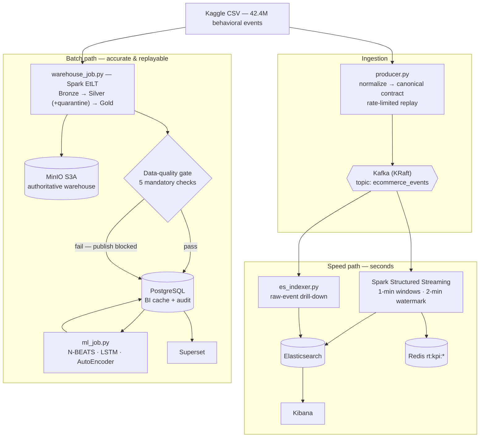

# E-commerce Behavioral Analytics — Lambda Architecture

An end-to-end data platform built around a **Lambda architecture**: one canonical
event contract feeds a *speed path* (low-latency, approximate) and a *batch path*
(accurate, replayable, dimensionally modelled), each with its own serving store
and its own BI surface.

The platform is deliberately **scope-honest**. The source contains exactly three
facts — product **views**, **cart** additions and **purchases** — plus users,
products, categories and sessions. There are no orders, payments, reviews, fraud
signals or geography in the data, and no layer of this system invents them.

---

## 1. Data source

**Kaggle — [eCommerce behavior data from multi-category store](https://www.kaggle.com/datasets/mkechinov/ecommerce-behavior-data-from-multi-category-store)**
(published by `mkechinov`) — real clickstream from a large multi-category online
store, not synthetic data.

### Volume and coverage

Measured directly on the local copy of the files, not quoted from the dataset page:

| File | Rows | Size | Period covered |
|---|---:|---:|---|
| `2019-Oct.csv` | **42,448,764** | 5.67 GB | 2019-10-01 00:00:00 → 2019-10-31 23:59:59 UTC |
| `2019-Nov.csv` | **67,501,979** | 9.01 GB | 2019-11-01 00:00:00 → 2019-11-30 23:59:59 UTC |
| **Total** | **109,950,743** | **≈ 14.7 GB** | 61 consecutive days |

```bash
# how the figures above were obtained
awk -F, 'NR>1{n++; t[$2]++} END{printf "TOTAL=%d\n", n; for (k in t) printf "%s=%d\n", k, t[k]}' 2019-Oct.csv
```

### Schema (9 columns, exactly as shipped)

```text
event_time,event_type,product_id,category_id,category_code,brand,price,user_id,user_session
2019-10-01 00:00:00 UTC,view,44600062,2103807459595387724,,shiseido,35.79,541312140,72d76fde-8bb3-4e00-8c23-a032dfed738c
```

Note the empty `category_code` in that very first row — missing category codes,
missing brands and a dotted-hierarchy category format are all handled explicitly
by the pipeline rather than assumed away.

### Event distribution — the analytical challenge (`2019-Oct.csv`)

| `event_type` | Rows | Share |
|---|---:|---:|
| `view` | 40,779,399 | 96.07 % |
| `cart` | 926,516 | 2.18 % |
| `purchase` | 742,849 | 1.75 % |

This ~55 : 1 view-to-purchase imbalance is precisely what makes the funnel worth
modelling, and it is why the batch layer computes conversion as **same-day
population ratios** over distinct users rather than naive event ratios.

### Why this dataset drives the design

- **Scale forces real distributed processing.** 42 M rows in a single monthly
  file rules out a pandas-in-memory approach; Spark and a partitioned lake are a
  requirement, not decoration.
- **Its grain is one behavioral event.** One `purchase` row is one purchase
  **event/item** — *never* an order. Every metric in this repository respects
  that: `revenue` is the sum of `price` over purchase events and is never
  presented as an order metric.
- **`user_session` is source-provided**, so sessionization is a fact of the data,
  not a heuristic this project invented.

### Getting the data

The CSVs are far too large for Git and are excluded via `.gitignore`. Download
from the link above, unzip, and place the files at:

```text
data/data_kaggle/2019-Oct.csv
data/data_kaggle/2019-Nov.csv
```

A small fixture (`tests/fixtures/`) ships with the repo, so the test suite and a
smoke run work without downloading anything.

---

## 2. Architecture at a glance



**Storage roles are explicit and enforced in code**

| Store | Role | Not |
|---|---|---|
| **MinIO (S3A)** | Authoritative warehouse — Bronze / Silver / Gold, replayable history | — |
| **PostgreSQL** | *BI cache only* — compact marts + ML outputs + audit trail | Not the system of record |
| **Elasticsearch** | Realtime search & time-series store behind Kibana | Not queried by the batch path |
| **Redis** | Latest realtime KPI counters for a low-latency API surface | Not a dashboard source |

---

## 3. Technology stack

| Concern | Choice | Version |
|---|---|---|
| Streaming bus | Apache Kafka (KRaft, no ZooKeeper) | 4.2.0 |
| Distributed processing | Apache Spark (batch + Structured Streaming) | 3.5.1 |
| Object store / lakehouse | MinIO (S3A) | 2025-09 release |
| BI serving DB | PostgreSQL | 18.3 |
| Realtime KPI cache | Redis | 8.6.2 |
| Search & realtime analytics | Elasticsearch + Kibana | 8.18.0 |
| Batch BI | Apache Superset | 4.1.1 |
| Forecasting | Darts (N-BEATS, LSTM/RNN) + PyTorch | ≥ 0.27 |
| Anomaly detection | PyOD AutoEncoder, scikit-learn fallback | ≥ 1.1 |
| Orchestration (current) | Idempotent PowerShell runner + Compose profiles | — |

---

## 4. What each layer actually does

### 4.1 Contract & configuration layer — `config/`

The foundation the rest of the system is built on: **one contract, one place for
runtime configuration.**

- **`schema.py` — the canonical event contract.** Nine fields
  (`event_time, event_type, user_id, user_session, product_id, category_id,
  category_code, brand, price`). `normalize_event()` maps raw source columns *and*
  already-canonical keys onto that shape, resolving event-type aliases
  (`page_view → view`, `add_to_cart → cart`) and defaulting a missing
  `category_code` to `unknown` rather than dropping the row.
  `validate_event()` rejects unsupported event types, missing identifiers and
  negative prices.
  The producer, the speed layer and the ES indexer all import this module, so
  **the layers cannot drift apart on event shape.** The Spark batch job
  implements the identical rules column-wise for scale, and a dedicated test
  pins the two implementations to the same behavior.
- **`settings.py`.** All runtime configuration is env-driven with safe local
  defaults, so identical code runs on a laptop, inside Docker and in CI.
  `DATA_LAKE_MODE` switches every lake write between local Parquet (dev/tests)
  and MinIO S3A (Docker) through a single `data_lake_uri(zone, dataset)` helper.

### 4.2 Ingestion layer — `data_ingestion/`

- **`producer.py`** streams the CSV into Kafka at a configurable rate (`--eps`),
  with bounded connection retries (5 attempts), `acks=all`, batching and
  partition keying by `user_session` (falling back to `user_id`) so all events of
  one session land on the same partition and stay ordered. Rows the contract
  rejects are dropped at the edge rather than being carried downstream.
  Supports `--loop` for continuous replay and `--test-mode` for a dry print.
- **`es_indexer.py`** is a separate consumer that bulk-indexes *raw* events into
  `ecommerce-events` (batch size 200, dedicated consumer group, deterministic
  `event_id`) so Kibana can drill down to individual events. This is intentionally
  split from the speed layer: aggregation and drill-down have different failure
  modes and different retention needs.
- **`schemas.py`** exposes the canonical contract as a Spark `StructType` used by
  the streaming reader.

### 4.3 Speed layer — `speed_layer/`

Spark Structured Streaming over the canonical topic:

- **1-minute tumbling windows** grouped by `event_type`, with a **2-minute
  watermark** to bound state and tolerate late arrivals; `update` output mode on a
  10-second processing trigger.
- Metrics per window: event count, `approx_count_distinct(user_id)`
  (HyperLogLog — the right accuracy/cost trade-off for a speed view), and summed
  amount, with revenue attributed only to `purchase` events.
- A single `foreachBatch` sink fans out to **both** serving stores in one pass:
  bulk upsert into Elasticsearch (`ecommerce-metrics`, deterministic
  `window:event_type` document id → idempotent re-delivery) and a pipelined Redis
  write of `rt:kpi:{event_type}` hashes (1-hour TTL) plus a trimmed
  `rt:kpi:revenue_series` list (last 240 points).
- Checkpointing is configured for restart-safe offsets.

### 4.4 Batch layer — `batch_layer/warehouse_job.py`

The heart of the project: a Spark **EtLT** pipeline composed of small, pure,
independently testable stages orchestrated by `run_warehouse()`.

| Stage | What it guarantees |
|---|---|
| `read_source` | CSV or JSON/JSONL, with source-file lineage attached |
| `write_bronze` | Append-only raw landing, partitioned by ingest date + run id |
| `normalize_events` | Canonical contract applied column-wise; **deterministic `event_key = SHA-256(event_type ‖ user_id ‖ product_id ‖ session_id ‖ event_time)`** |
| `split_valid_events` | Valid rows deduplicated by `event_key`; rejects **quarantined with a reason** (`unsupported_event_type`, `missing_user_id`, `negative_price`, …) instead of dropped |
| `read_canonical_silver` | Reprocessing-safe read: latest record wins per `event_key` |
| `build_dimensions` | `dim_date`, `dim_user`, `dim_product`, `dim_category` (SCD-1; surrogate keys via `xxhash64`; category hierarchy split from the dotted code) |
| `build_fact` | `fact_behavior_event` — exactly one row per valid source event |
| `build_marts` | Five BI marts (below) |
| `quality_checks` | Five mandatory gates |
| `write_gold` | Star schema + marts written to the MinIO Gold zone |
| `publish_postgres` | Atomic staging → cache swap |

**Idempotency.** Because `event_key` is content-derived, replaying the same file
never duplicates a fact — the same run can be re-executed safely after a failure.

**Data-quality gate (blocking).** The job **refuses to publish** if any of these
fail: Silver non-empty · `event_key` unique · required identifiers/timestamps
complete · zero dimension orphans in the fact · product dimension non-empty.
Every check — pass or fail, with its observed value and its expectation — is
persisted to `audit.data_quality_result`, and every run to `audit.pipeline_run`
(status, row counts per zone, rejected rows, error message). **A failed run is
therefore as observable as a successful one.**

**Atomic publish.** Marts are written to a `staging` schema over JDBC, then a
single transaction truncates and refills `cache`. Superset always sees either
the last good version or the complete new version — **never a half-loaded
dashboard.**

**Marts produced:** `funnel_daily` (viewers → cart users → buyers with
view→cart, cart→purchase, conversion and abandonment rates), `product_daily`,
`category_daily`, `session_daily` (duration, counts, and an outcome label of
`converted` / `abandoned_cart` / `browsing`) and `daily_revenue` — the feature
table consumed by the ML job.

### 4.5 Batch ML layer — `batch_layer/analytics/`, `ml_job.py`

Two production concerns modelled as extensible strategies, not as notebook code.

- **Forecasting — Strategy + Template Method.** `Forecaster` (abstract) owns the
  shared workflow: history preparation, series construction, scaling, covariate
  building, prediction inverse-transform and fallback. Concrete strategies
  (`NBeatsForecaster`, `LstmForecaster`) implement only `_train()`.
  `TrendPredictor` orchestrates any set of strategies — **open for extension,
  closed for modification**: adding a model touches neither the orchestrator nor
  any caller.
- **Numerical engineering, documented in code.** Revenue is raw-scale, which made
  the RNN collapse toward zero on a short series; a Darts `Scaler` fit at train
  time and inverted at predict time fixes it. N-BEATS additionally enables
  **RevIN** for level/variance shift. Each strategy declares which covariate kind
  its Darts class actually supports (`past` vs `future`), resolved through a
  single helper so `fit()` and `predict()` cannot disagree.
- **Feature engineering under data scarcity.** The daily aggregation of a single
  monthly file yields only ~31 points, so cyclical day-of-week (`sin`/`cos`) plus
  a weekend flag squeeze extra signal out of the existing window rather than
  demanding a longer history.
- **Honest evaluation.** `backtest()` runs a **rolling-origin (walk-forward)**
  evaluation — expanding train window, origin moved forward per fold — and
  averages MAE / MSE / RMSE / MAPE per model across folds, degrading to a single
  split when history is too short. Per-fold detail is retained for inspection.
  This avoids drawing conclusions from one lucky split.
- **Anomaly detection.** PyOD **AutoEncoder** over
  `(revenue, purchase_events, avg_purchase_value)` with standardized features and
  a batch size capped for short daily series (PyOD's loader drops the last partial
  batch and would otherwise train on zero batches).
- **Graceful degradation as a design rule.** If `darts` / `pyod` / `torch` are
  unavailable, forecasting falls back to a naive baseline and detection to
  `IsolationForest`, and the active backend is reported. **The pipeline always
  completes and always says what it actually ran.**

### 4.6 Serving layer — `serving_layer/`, `batch_layer/postgres_cache.py`

Storage access sits behind small, intention-revealing gateways rather than being
scattered across jobs.

- `PostgresCacheSync` — reads the `daily_revenue` feature table, writes
  `predictions` / `anomalies` with truncate-and-insert so consumers never see a
  partially refreshed model output.
- `postgres_views.py` — reshaping views over the cache for common charts
  (`v_revenue_forecast` for actual-vs-forecast, `v_anomaly_days`, `v_top_products`),
  managed by a `create` / `drop` CLI.
- `redis_cache.py` — typed read helpers over `rt:kpi:*` for a low-latency KPI/API
  surface.

### 4.7 Presentation layer — `display/`

Dashboards are **provisioned as code**, not clicked together by hand.

- **Superset (batch BI)** — automated bootstrap (`setup_superset.sh`), runtime
  patching, declarative database + dataset registration (`datasources.yaml`),
  and scripted dashboard creation for both the descriptive marts and the ML
  outputs (forecast comparison + anomalies).
- **Kibana (realtime)** — data views and a speed-layer dashboard created through
  the Saved Objects API. Classic aggregation-based visualizations were chosen
  over Lens **deliberately**: their saved-object schema is stable across Kibana
  versions, avoiding migration-sensitive internal state.

### 4.8 Infrastructure & operations

- **`docker-compose.yml`** — the full stack with health checks and
  `depends_on: service_healthy` conditions so start-up ordering is real rather
  than hopeful; buckets auto-created by an init container; heavy one-shot jobs
  behind a `jobs` **profile** so they never run resident.
- **`docker/spark-warehouse/Dockerfile`** — a pinned Spark 3.5.1 image with the
  PostgreSQL JDBC and S3A jars baked in. Dependency resolution is kept *out* of
  application code, so batch runs are reproducible and work offline.
- **`scripts/init_postgres.sql`** — idempotent DDL for the `cache`, `staging` and
  `audit` schemas, applied at container init *and* before every publish.
- **`scripts/start_all.ps1`** — one-command runner with composable switches
  (`-RunEverything`, `-RunRealtime`, `-RunBatch`, `-RefreshBI`, `-SmokeCheck`,
  `-BuildWarehouseImage`, …), plus `smoke_fullstack.ps1` and
  `validate_warehouse.sql` for post-run verification.

### 4.9 Quality assurance — `tests/`

**27 tests, all passing** (`pytest tests/ -q`), covering the parts most likely to
break silently:

| Area | What is asserted |
|---|---|
| Canonical contract | Normalization, alias mapping, validation rules, wire serialization |
| Ingestion contract | The source mapping preserves **only** facts the data actually contains |
| Spark warehouse transforms | Normalization preserves source grain · star schema has **no orphans** · funnel and session marts are correct |
| Speed layer | Windowed aggregation by event type |
| ML | Forecast shape per strategy, backtest metrics per model, anomaly labelling |
| Cache gateway | Prediction/anomaly write contract |
| Lake I/O | Local and S3A path resolution |

---

## 5. Data model

Full detail — canonical contract, medallion zones, star-schema ERD, mart grains,
ML output tables and audit tables — lives in
**[docs/DATA_MODEL.md](docs/DATA_MODEL.md)**; architecture rationale and design
patterns in **[docs/ARCHITECTURE.md](docs/ARCHITECTURE.md)**.

Summary of the Gold star schema:

- `fact_behavior_event` — one row per valid source event, keyed by a
  content-derived `event_key`.
- `dim_date`, `dim_user`, `dim_product`, `dim_category` — SCD Type 1.

Semantics are stated precisely: `revenue` is the sum of `price` over purchase
events and is **never** described as an order metric; funnel rates are same-day
population ratios, **not** ordered-path attribution.

---

## 6. Quick start

Requires Docker Desktop (≥ 8 GB RAM) and the Kaggle CSV at
`data/data_kaggle/2019-Oct.csv` (see §1). Runtime configuration is read from
`.env` at the repository root; every value has a working local default in
`config/settings.py`.

```powershell
# Full stack: infra + realtime + producer + batch EtLT + ML + BI
.\scripts\start_all.ps1 -RunEverything -Source .\data\data_kaggle\2019-Oct.csv -BuildWarehouseImage

# Batch + ML + BI only (warehouse image already built)
.\scripts\start_all.ps1 -RunBatch -RefreshBI -Source .\data\data_kaggle\2019-Oct.csv

# Smoke run on the bundled fixture — no dataset download required
.\scripts\start_all.ps1 -RunBatch -Source .\tests\fixtures\events.csv

# Test suite
.\.venv\Scripts\python.exe -m pytest tests\ -q
```

| Service | URL | Credentials |
|---|---|---|
| Superset (batch BI) | http://localhost:8088 | `admin` / `admin` |
| Kibana (realtime) | http://localhost:5601 | — |
| MinIO console | http://localhost:9001 | `minioadmin` / `minioadmin` |
| Spark master UI | http://localhost:8080 | — |
| Elasticsearch | http://localhost:9200 | — |
| PostgreSQL | `localhost:5433` | `admin` / `admin123` |

---

## 7. Repository layout

```text
config/
  schema.py                 Canonical event contract (normalize · validate · wire)
  settings.py               Env-driven runtime configuration (local ⇄ S3A)
data_ingestion/
  producer.py               Kaggle CSV → Kafka (canonical events)
  schemas.py                Spark StructType for the contract
  es_indexer.py             Kafka → Elasticsearch raw events
speed_layer/
  speed_layer.py            Structured Streaming → Elasticsearch + Redis
batch_layer/
  warehouse_job.py          Spark EtLT, quality gate, atomic cache publish
  ml_job.py                 Forecasting + anomaly detection orchestration
  postgres_cache.py         ML cache gateway
  analytics/                base.py · forecasters.py · trend_predictor.py · anomaly_detector.py
serving_layer/
  postgres_views.py         Convenience views over the BI cache
  redis_cache.py            Realtime KPI read helpers
display/
  superset/                 Superset provisioning + dashboards as code
  kibana/                   Kibana data views + speed dashboard
docker/spark-warehouse/     Pinned Spark 3.5.1 batch image (JDBC + S3A jars)
scripts/                    init_postgres.sql · start_all.ps1 · smoke & validation
docs/                       ARCHITECTURE.md · DATA_MODEL.md
tests/                      Contract, Spark transform, streaming, ML tests
```
