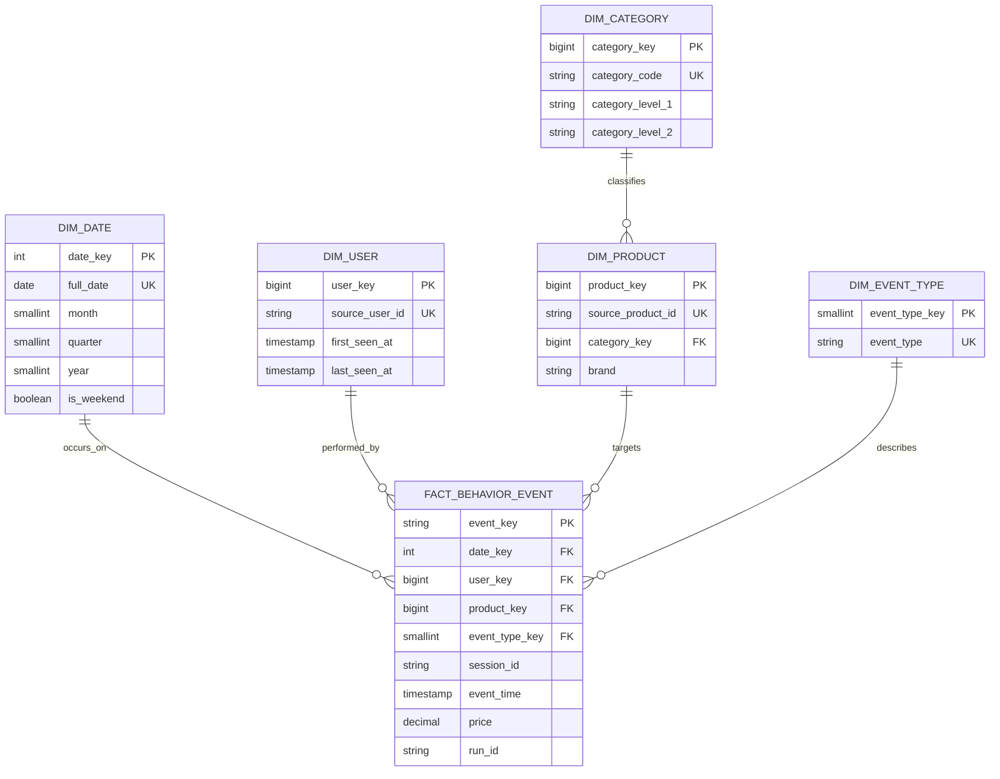

# Data model

The whole platform answers three questions from the Kaggle Multi-Category Store
behavior dataset:

1. Where do users leave the **view → cart → purchase** funnel?
2. Which products and categories attract attention and convert?
3. How do sessions end — browsing, abandoned cart, or converted?

The dataset contains **only** `view`, `cart` and `purchase` events. There are no
orders, payments, reviews, fraud or geography, and the model never invents them.

## 1. Canonical event contract

Defined once in `config/schema.py` and mirrored for Spark in
`data_ingestion/schemas.py` (`BEHAVIOR_EVENT_SCHEMA`). Every layer speaks it.

| Field | Type | Notes |
|---|---|---|
| `event_time` | timestamp | ISO-8601 on the wire |
| `event_type` | string | `view` \| `cart` \| `purchase` (aliases normalized) |
| `user_id` | string | required |
| `user_session` | string | nullable |
| `product_id` | string | required |
| `category_id` | string | |
| `category_code` | string | dotted hierarchy, e.g. `electronics.smartphone` |
| `brand` | string | |
| `price` | double | non-negative |

`normalize_event` maps raw rows to this shape and drops everything else;
`validate_event` rejects unsupported types, missing `user_id`/`product_id`, and
negative prices.

## 2. Medallion zones (MinIO — authoritative warehouse)

| Zone | Path | Purpose | Write policy |
|---|---|---|---|
| Bronze | `bronze/ecommerce_events` | Raw ingestion + metadata | Append-only |
| Silver | `silver/behavior_events` | Validated canonical events | Append by run/date |
| Silver quarantine | `silver/quarantine/behavior_events` | Rejected rows + reason | Append-only |
| Gold warehouse | `gold/warehouse/*` | Star schema (dims + fact) | Rebuilt from Silver |
| Gold mart | `gold/mart/*` | BI marts | Rebuilt from Silver |

## 3. Star schema (Gold warehouse)

### Grain

`fact_behavior_event` has exactly one row per valid source event. The
deterministic `event_key` is `SHA-256(event_type ‖ user_id ‖ product_id ‖
session_id ‖ event_time)`, so reprocessing the same record never duplicates a
fact. Dimensions are SCD Type 1 (product attributes in this dataset are stable).

## 4. BI marts (Gold mart → PostgreSQL `cache`)

The MinIO gold zone holds the full star schema. PostgreSQL only caches these
compact marts so Superset always has data.

| Mart | Grain | Key metrics |
|---|---|---|
| `funnel_daily` | day | viewers, cart_users, buyers, view→cart, cart→purchase, conversion, abandonment |
| `product_daily` | day × product | views, cart_adds, purchase_events, revenue, rates |
| `category_daily` | day × category | views, cart_adds, purchase_events, revenue, conversion |
| `session_daily` | session | duration, counts, `session_outcome` (converted/abandoned_cart/browsing) |
| `daily_revenue` | day | revenue, purchase_events, buyers, avg_purchase_value (ML feature table) |

`revenue` sums `price` over purchase events; it is never described as an order
metric. Funnel rates are same-day population ratios, not ordered-path attribution.

## 5. ML outputs (PostgreSQL `cache`)

| Table | Produced by | Columns |
|---|---|---|
| `predictions` | Darts N-BEATS + LSTM | `forecast_date, model, predicted_revenue` |
| `anomalies` | PyOD AutoEncoder | `event_date, anomaly_label, anomaly_score, revenue, purchase_events, avg_purchase_value` |

## 6. Audit (PostgreSQL `audit`)

`pipeline_run` (run status + row counts) and `data_quality_result` (per-check
results). The batch job stops before publishing if any mandatory quality check
fails:

- Silver is not empty.
- `event_key` is unique.
- Required identifiers/timestamps are complete.
- Every fact resolves to a user and product dimension.
- The product dimension is not empty.

Rejected rows stay queryable in Silver quarantine with a reason.

## Publish consistency

Spark writes each mart to the `staging` schema, then one transaction truncates
and refills the `cache` tables. Superset therefore always sees either the last
good version or the complete new version — never a half-loaded dashboard.
