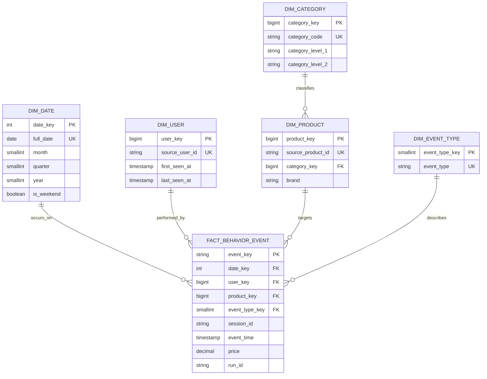

# Data model

The platform answers three questions about **public marketplace listings**:

1. How does an offer's advertised price move over time?
2. How complete and how fresh is each source's coverage?
3. When something changes on a listing, how quickly can we see it?

It observes only what a marketplace shows a visitor: a title, a price, an
availability word, a rating, and counters the site displays. There are no
orders, no payments, no carts, no users, and the model never invents them.

> **A counter change is not a sale.** `sold_count` is a number the site
> renders. It can jump, reset, or be rounded. Every table that touches it
> keeps the raw delta *and* the validity verdict side by side, and never
> calls the result demand.

The Kaggle behavior model the project started from is still here, in
section 9, and belongs to the `legacy` profile only.

## 1. The three frozen contracts

Owned by `config/marketplace_schema.py`, serialised and validated field for
field by `config/marketplace_wire.py`. A wire record carrying an unexpected
field is refused, so a contract cannot drift without a schema version bump.

### 1.1 Observation — `marketplace.observations.v1`

One row per *sighting* of one offer. The envelope carries the routing and the
crawl lineage; the payload carries the offer and the observation.

| Group | Fields |
|---|---|
| envelope | `event_id`, `schema_version`, `event_type`, `occurred_at`, `produced_at`, `marketplace`, `partition_key`, `crawl_run_id`, `raw_uri`, `payload` |
| `payload.offer` | `offer_id`, `marketplace_id`, `platform_listing_id`, `seller_id`, `product_title`, `brand`, `category_path`, `source_url`, `currency`, `first_seen_at`, `last_seen_at`, `active_status` |
| `payload.observation` | `observation_id`, `offer_id`, `observed_at`, `fetched_at`, `current_price`, `list_price`, `shipping_price`, `discount_amount`, `discount_percent`, `rating_value`, `rating_scale`, `rating_count`, `review_count`, `sold_count`, `availability`, `promotion`, `ranking_position` |
| raw lineage (on the observation) | `raw_uri`, `raw_sha256`, `adapter_version`, `crawl_run_id` |

The envelope is not free to disagree with its payload. Construction refuses a
record whose `event_id` is not the observation's `observation_id`, whose
`occurred_at` is not its `observed_at`, or whose `crawl_run_id` or `raw_uri`
differ from the observation's — so there is exactly one answer to "when was
this seen" and "where is the body".

**Identity.** `observation_id` is derived from the marketplace, the platform
listing id, `observed_at` and the raw hash; `offer_id` from the marketplace
and the platform listing id. Both are deterministic, which is what makes the
whole pipeline replayable: re-ingesting the same record overwrites itself.

Kafka key: `(marketplace, platform_listing_id)`, so every observation of one
listing lands on one partition and keeps its order.

### 1.2 Change — `marketplace.changes.v1`

Emitted by the speed layer when consecutive observations of one offer differ.
Exactly **seven** types, frozen (Brief section 10):

`NEW_OFFER`, `PRICE_CHANGED`, `LARGE_PRICE_DROP`, `RATING_CHANGED`,
`COUNTER_CHANGED`, `AVAILABILITY_CHANGED`, `OFFER_STALE`.

| Field | Notes |
|---|---|
| `event_id` | `SHA-256` of offer, current observation, type and rule version |
| `schema_version`, `rule_version` | the rules that produced this verdict travel with it |
| `change_type` | one of the seven |
| `detected_at` | when the speed layer decided, not when the site changed |
| `marketplace`, `offer_id` | |
| `previous_observation_id`, `current_observation_id` | null previous only for `NEW_OFFER` |
| `field_name` | null for `NEW_OFFER` and `OFFER_STALE`, required otherwise |
| `previous_value`, `current_value` | a scalar, except `NEW_OFFER`, which carries the whole offer |

Kafka key: the offer id.

`OFFER_STALE` means no observation arrived within
`MARKETPLACE_STALE_AFTER_SECONDS`. It does **not** mean the offer ended; it
means the crawler has not looked, or has not succeeded.

### 1.3 DLQ — `marketplace.observations.v1.dlq`

A record the Silver sink could not accept, with the evidence to diagnose it.

| Field | Notes |
|---|---|
| `dlq_id` | derived from topic, partition, offset and stage |
| `schema_version`, `failed_at` | the contract version, and when the sink refused it |
| `stage` | `DECODE` or `CONTRACT_VALIDATION` — those two, and nothing else |
| `source_topic`, `source_partition`, `source_offset`, `source_key` | where it came from |
| `marketplace`, `crawl_run_id`, `raw_artifact_id`, `raw_uri` | whatever could be salvaged |
| `error_type`, `error_message` | truncated to 2000 characters |
| `payload_text` | the record as received, capped at 1 MiB |

**A valid observation can never arrive here.** A write that failed is a
storage problem and is retried at the same offset; only a record that could
not be decoded or failed its contract is quarantined.

## 2. Medallion zones (MinIO — the authoritative warehouse)

| Zone | Path | Write policy |
|---|---|---|
| Bronze | `bronze/marketplace/raw/marketplace=<m>/observed_date=<d>/hour=<h>/crawl_run_id=<r>/raw_artifact_id=<a>/{body.bin,metadata.json}` | append-only; never rewritten |
| Silver | `silver/marketplace/offer_observations/marketplace=<m>/observed_date=<d>/observation_id=<o>.json` | one object per observation, idempotent by path |
| Silver quarantine | `silver/quarantine/offer_observations/observed_date=<d>/source_topic=<t>/partition=<p>/offset=<n>.json` | append-only |
| Gold run | `gold/marketplace/runs/run_id=<run>/<dataset>/...` | one directory per run; never overwritten |
| Gold manifest | `gold/marketplace/manifests/run_id=<run>/manifest.json` | one per run, refused runs included |
| Gold pointer | `gold/marketplace/current.json` | replaced whole, by promotion only |

Every raw body has a metadata sidecar carrying `body_sha256`.
`crawler/reparse.py` verifies that checksum **before** parsing: a corrupted
artifact is never handed to a parser, because parsing it would launder
corruption into Silver-shaped output that looks canonical.

The Silver object path is a pure function of the observation, so a
re-delivered Kafka record rewrites the same object with the same bytes. That
is what makes "commit the offset only after the write" safe.

## 3. The Gold manifest and the serving pointer

```json
{
  "manifest_schema_version": "marketplace-gold-manifest.v1",
  "run_id": "mp-20261003T1617Z",
  "as_of": "2026-10-03T16:17:00+00:00",
  "silver_uri": "s3a://ecommerce-silver/marketplace/offer_observations",
  "gold_run_uri": "s3a://ecommerce-gold/marketplace/runs/run_id=mp-20261003T1617Z",
  "rule_versions": {"quality": "quality-rules.v2", "...": "..."},
  "datasets": [{"dataset_name": "offer_current", "uri": "...", "row_count": 12,
                "partition_columns": ["marketplace", "observed_date"]}],
  "quality": {"status": "PASS", "mandatory_failure_count": 0},
  "previous_run_id": "mp-20261002T0000Z"
}
```

`created_at` equals `as_of` by construction — nothing in the manifest reads a
wall clock, so two runs of the same context serialise to identical bytes and a
replay can be checked by comparing files. Wall-clock times live in
`audit.marketplace_batch_run`.

`current.json` is byte-identical to the run manifest it promoted. One write
replaces the whole document, so a reader never observes a torn pointer.

## 4. Serving marts — `cache.marketplace_*`

Ten tables. The lake holds every run; PostgreSQL holds exactly one version,
the one `current.json` names.

| Table | Grain | What it carries |
|---|---|---|
| `marketplace_offer_current` | `offer_id` | the latest observed state of each offer, with its raw lineage |
| `marketplace_seller_current` | `(seller_id, marketplace)` | first and last seen, observed offer count |
| `marketplace_offer_price_history_daily` | `(marketplace, offer_id, observed_date, currency)` | first/last/min/max/avg price, observation and distinct-price counts |
| `marketplace_offer_change_daily` | same | transitions per day: price changes, drops, increases, rating, counter, availability |
| `marketplace_offer_freshness` | `offer_id` | `age_seconds` and `FRESH`/`STALE`/`FUTURE` **at the run's `as_of`** |
| `marketplace_category_price_daily` | `(marketplace, category_path, observed_date, currency)` | min, p25, median, p75, max, avg across observed offers |
| `marketplace_source_coverage_daily` | `(marketplace, observed_date)` | eligible vs observed vs missing offers, parsed and rejected counts, coverage and rejection rates |
| `marketplace_crawl_reliability_daily` | `(marketplace, request_date)` | requests, successes, failures, latency avg and p95, raw bytes, and a count for each of the five error kinds a crawl produces (rate limited, transport, server, parse, validation) |
| `marketplace_counter_delta_daily` | `(marketplace, offer_id, observed_date, counter_name)` | raw and valid delta sums, a velocity proxy, and the invalid-transition evidence |
| `marketplace_price_anomaly_daily` | `(marketplace, offer_id, observed_date, currency)` | a robust outlier verdict against this offer's own recent history |

Four of them carry a rule version in every row — `freshness_rule_version` on
freshness and coverage, `counter_rule_version`, `anomaly_rule_version` — so a
stored verdict stays checkable after the configuration moves on.

### Three gradings that are easy to misread

**Freshness** is judged at the run's `as_of`, not at query time. A `FUTURE`
row is a clock problem, not a fresh one.

**Counter deltas** are never clamped. A negative delta is kept and the row is
marked `counter_reset_or_invalid` with the reasons in
`invalid_reasons_json`. Hiding the reset would turn a site quirk into a
plausible-looking number. `velocity_proxy_per_hour` is a proxy for *how fast
the displayed number moved*, and is not a sales rate.

**Price anomaly** compares one offer against **its own** recent observed
price history, never against another offer. `anomaly_status` distinguishes
`NORMAL`, `ANOMALOUS_HIGH`, `ANOMALOUS_LOW`, `INSUFFICIENT_HISTORY` and
`INSUFFICIENT_DISPERSION` — the last two say "no verdict", which is not the
same as "normal". `currency` is part of the key, so an offer that switched
currency mid-day yields one row per currency rather than one nonsense row.
The row carries its own `window_days`, `min_samples`, `mad_threshold` and
`iqr_multiplier`. It is a statistical statement about a series, not a claim
that a price is wrong, dishonest or a bargain.

## 5. Audit — `audit.*`

Operational metadata only. No raw body, no cookie, no authorization header,
no traceback, in any of these tables.

### 5.1 The crawl

| Table | Key | Notes |
|---|---|---|
| `crawl_frontier` | `task_id` | what to crawl and when: tier, priority, `scheduled_for`, `status`, attempts, and the lease. A constraint enforces that only a `LEASED` row carries lease fields, and that it carries both |
| `crawl_run` | `crawl_run_id` | one pass of a worker: requested, succeeded, failed, adapter version |
| `crawl_request_attempt` | `attempt_id` | one HTTP attempt: status, latency, raw bytes and URI, `parsed_count`, `rejected_count`, `error_kind` |
| `crawl_source_state` | `marketplace_code` | consecutive failures and `opened_until`. **There is no boolean**: the circuit is open only while `opened_until > now()` |

`error_kind` is a closed set: `RATE_LIMITED`, `TRANSIENT_NETWORK`,
`SERVER_ERROR`, `CLIENT_ERROR`, `ROBOTS_DENIED`, `STORAGE_ERROR`,
`PARSE_ERROR`, `VALIDATION_ERROR`, `PUBLISH_ERROR`, `UNKNOWN`.

`PUBLISH_ERROR` was added in Phase 8 for a Kafka failure *after* a good fetch
and parse. Its `parsed_count` is the **acknowledged** count, not the parsed
one — so an attempt that parsed eight and published three records three. The
raw body is in Bronze either way.

### 5.2 The batch

| Table | Key | Notes |
|---|---|---|
| `marketplace_batch_run` | `run_id` | `as_of`, both URIs, row counts, `dataset_counts`, `cache_published`, `manifest_uri`, `manifest_promoted`, and `status` |
| `marketplace_quality_result` | `(run_id, check_name)` | severity, dataset, `PASS`/`FAIL`/`SKIPPED`, observed value, expectation, rule version, and a small identifiers-only failure sample |
| `marketplace_cache_version` | singleton | which `run_id` the cache currently holds, when, its dataset counts, the quality rule version and the manifest URI |

`status` is one of `RUNNING`, `GOLD_WRITTEN`, `QUALITY_FAILED`, `SUCCEEDED`,
`FAILED`. **`QUALITY_FAILED` is deliberately distinct from `FAILED`**: the run
produced complete, inspectable Gold and was refused, which is a different
operational situation from a crash. A row is written for every rule on every
run, refused runs included — a blocked publication with no stored evidence
cannot be told apart from a crash.

`marketplace_cache_version` is a singleton by constraint, so "which version is
live" has exactly one answer, and `ops validate` compares it to the pointer.

### 5.3 The speed layer

`marketplace_speed_batch`, keyed `(query_name, query_id, batch_id)`.

The `query_id` is not decoration. Batch IDs restart at 0 under a new
checkpoint, so without it a replay's batch 0 is mistaken for the old run's and
skipped as already `SUCCEEDED` — which is exactly what stopped the Phase 8
index rebuild until it was fixed. A check constraint also enforces
`input_rows = invalid + applied + duplicate + late`.

## 6. Elasticsearch

| Index | Written by | `_id` | Holds |
|---|---|---|---|
| `marketplace-changes-v1` | speed layer | `event_id` | change events |
| `marketplace-offers-current-v1` | speed layer | `offer_id` | current offer state |
| `marketplace-source-health-v1` | `ops/es_projector.py` | `marketplace_code` | circuit state, consecutive failures, last success, freshness |
| `marketplace-crawl-attempts-v1` | projector | `attempt_id` | the attempt audit, joined to the frontier's marketplace |
| `marketplace-speed-batches-v1` | projector | `query_name:query_id:batch_id` | micro-batch outcomes and durations |
| `marketplace-dlq-v1` | projector | `dlq_id` | quarantined records, **without `payload_text`** |

Every `_id` is derived from the row's own key, which makes a projection
idempotent: the projector re-reads an overlap window every pass, and a
re-projected row overwrites itself.

Mappings come from composable index templates. Money is `scaled_float` with
scaling factor 1 000 000 — the same six decimal places as the
`decimal(38,6)` cache columns, where a `float` would round 199000.99 away.
Identifiers are `keyword`. The four projector indices are `dynamic: strict`,
so a field the projector did not mean to write is a loud failure rather than a
silent new column.

`previous_value` / `current_value` are the one awkward case: a scalar for most
change types, the whole offer for `NEW_OFFER`, and no Elasticsearch field is
both. The sink stores an object value as its canonical JSON string, and the
template maps the field as `keyword` with a `scaled_float` sub-field carrying
`ignore_malformed`, so price charts aggregate and the JSON string is skipped
rather than rejecting the document. The wire contract is unchanged.

A template applies only to an index created after it. Recreating an index
that predates its template is in the runbook.

## 7. Redis

| Key | Type | Member / value | TTL |
|---|---|---|---|
| `rt:changes:recent` | sorted set | `event_id`, scored by `detected_at` in epoch microseconds, trimmed to `REDIS_MARKETPLACE_RECENT_CHANGES_MAX` | — |
| `rt:change:<event_id>` | string | the change event as canonical JSON | `REDIS_MARKETPLACE_OFFER_TTL_SECONDS` |
| `rt:offer:<offer_id>` | hash | `state_json`, `offer_id`, `marketplace`, `observation_id` | same |
| `rt:source:<marketplace>:last_observation` | string | the newest `observed_at` seen, advanced only forwards | — |

Membership by `event_id` and `offer_id` is what keeps a replay from
duplicating anything: the same event written twice is the same member.

## 8. Backup

What a backup carries, and why, is in [RUNBOOK.md](RUNBOOK.md). The short
version for this document: Bronze and Silver whole, the Gold manifests and
pointer, the Gold run the pointer names, and `pg_dump` of `audit` and `cache`.
Kafka, Elasticsearch, Redis and the speed checkpoints are **not** backed up —
they are derived, and they refill from new crawls.

## 9. Legacy: the Kaggle behavior model

Belongs to the `legacy` and `jobs` profiles. Kept because the project started
here and the report compares the two.

The Kaggle Multi-Category Store dataset contains only `view`, `cart` and
`purchase` events — no orders, payments, reviews, fraud or geography — and the
model never invents them. The one canonical event contract is in
`config/schema.py`: `event_time`, `event_type`, `user_id`, `user_session`,
`product_id`, `category_id`, `category_code`, `brand`, `price`.

Zones: `bronze/ecommerce_events`, `silver/behavior_events` (plus a
quarantine), `gold/warehouse/*` and `gold/mart/*`.



`fact_behavior_event` has one row per valid source event; `event_key` is
`SHA-256(event_type ‖ user_id ‖ product_id ‖ session_id ‖ event_time)`, so
reprocessing never duplicates a fact. Dimensions are SCD Type 1.

Marts in `cache`: `funnel_daily`, `product_daily`, `category_daily`,
`session_daily`, `daily_revenue`. `revenue` sums `price` over purchase events
and is never described as an order metric; funnel rates are same-day
population ratios, not ordered-path attribution. ML outputs go to
`cache.predictions` (Darts N-BEATS and LSTM) and `cache.anomalies` (PyOD
AutoEncoder).

Its audit is `audit.pipeline_run` and `audit.data_quality_result` — separate
tables from the marketplace ones on purpose: that pair belongs to the
behavioural pipeline, its `checked_at` is a naive timestamp, and its key has
no room for severity or dataset. Sharing them would couple two unrelated
pipelines through one migration.

## Publish consistency (both pipelines)

Spark writes each mart to the `staging` schema, then one transaction truncates
and refills the `cache` tables. Superset therefore always sees either the last
good version or the complete new version — never a half-loaded dashboard. A
refused publish rolls the truncate back with it, which is why drill D9 leaves
the twelve serving rows untouched.
