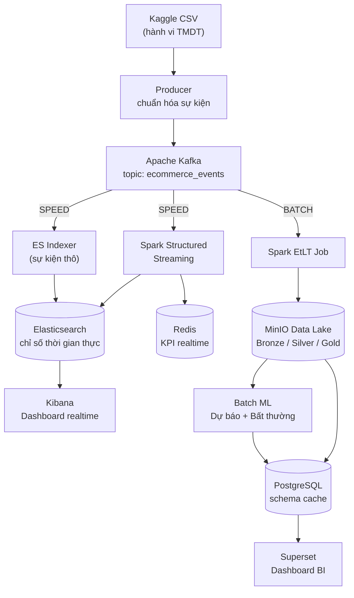
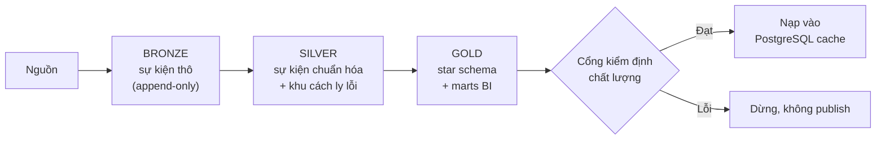
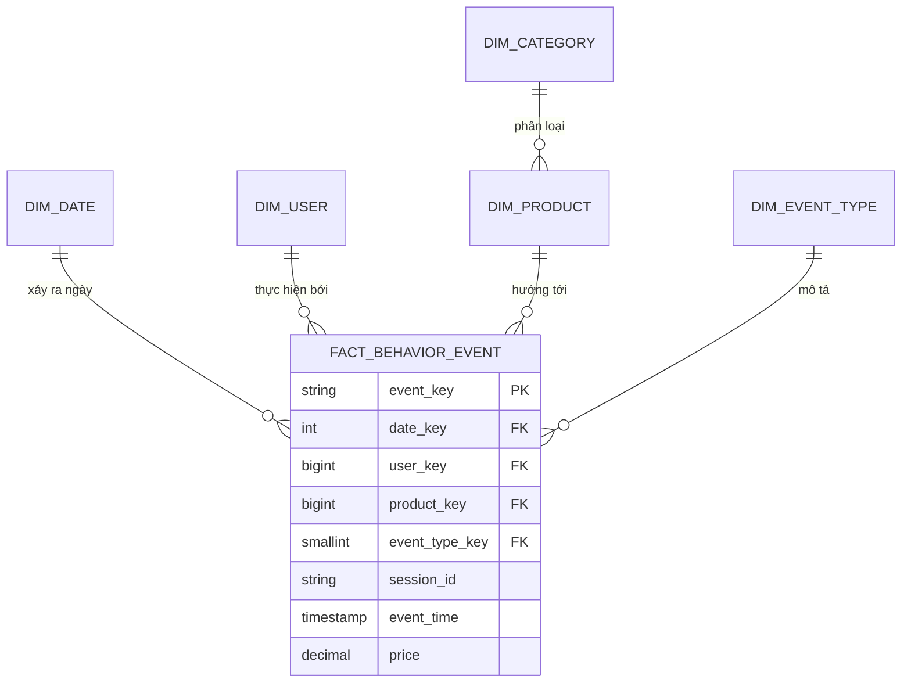
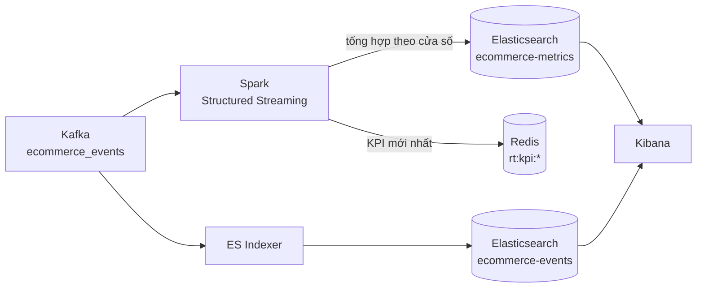

# Tài liệu tổng hợp kiến trúc — dùng để viết báo cáo đồ án

> **Cách dùng:** Dán toàn bộ file này cho AI kèm yêu cầu, ví dụ:
> *"Dựa trên tài liệu dưới đây, hãy viết báo cáo tổng quan về kiến trúc và luồng
> xử lý dữ liệu của đồ án (Lambda Architecture cho phân tích hành vi TMDT). Trình
> bày theo văn phong học thuật, có phần mở đầu, thân bài theo từng lớp, sơ đồ mô
> tả, và kết luận. Không cần đi vào chi tiết code."*
>
> Tài liệu chỉ mô tả ở mức **kiến trúc và luồng dữ liệu**, không chứa code.

---

## 1. Giới thiệu & mục tiêu

Đồ án xây dựng một nền tảng phân tích **hành vi người dùng thương mại điện tử**
theo mô hình **Lambda Architecture**, xử lý bộ dữ liệu công khai *Kaggle
Multi-Category Store* (hành vi mua sắm trên sàn TMDT nhiều ngành hàng).

Nền tảng trả lời ba câu hỏi nghiệp vụ:

1. Người dùng rời khỏi phễu **xem → thêm giỏ → mua** (view → cart → purchase) ở đâu?
2. Sản phẩm và ngành hàng nào thu hút và chuyển đổi tốt?
3. Phiên truy cập kết thúc thế nào: chỉ duyệt, bỏ giỏ, hay chuyển đổi?

**Phạm vi có chủ đích:** bộ dữ liệu chỉ có ba loại sự kiện `view`, `cart`,
`purchase`. Hệ thống **không** mô phỏng đơn hàng, thanh toán, đánh giá, gian lận
hay vị trí địa lý — vì nguồn dữ liệu không có những dữ kiện đó. Đây là một
nguyên tắc thiết kế quan trọng: mô hình chỉ phản ánh trung thực dữ liệu nguồn.

## 2. Tổng quan kiến trúc Lambda

Lambda Architecture chia xử lý thành hai nhánh song song từ cùng một nguồn nạp:

- **Batch layer (lớp mẻ):** xử lý chính xác, đầy đủ, có thể tái chạy (replay);
  xây dựng kho dữ liệu phân tích và mô hình học máy.
- **Speed layer (lớp tốc độ):** xử lý luồng thời gian thực, độ trễ thấp, phục vụ
  giám sát tức thời.

Mỗi nhánh có kho phục vụ (serving) và dashboard riêng, nhưng cùng tuân theo **một
hợp đồng dữ liệu sự kiện chung** (canonical contract) nên không bao giờ mâu thuẫn.

## 3. Sơ đồ luồng dữ liệu tổng thể

**Diễn giải luồng:**

1. Dữ liệu Kaggle CSV được **Producer** đọc, chuẩn hóa về hợp đồng sự kiện chung,
   rồi đẩy vào **Kafka** (một topic duy nhất).
2. **Nhánh tốc độ:** Spark Structured Streaming đọc Kafka, tính các chỉ số theo
   cửa sổ thời gian (số sự kiện, người dùng, doanh thu/phút), ghi vào
   **Elasticsearch** (cho Kibana) và **Redis** (KPI tức thời). Một tiến trình
   *indexer* song song đẩy sự kiện thô sang Elasticsearch để soi chi tiết.
3. **Nhánh mẻ:** Spark job đọc dữ liệu, đi qua kiến trúc **medallion**
   Bronze → Silver → Gold trên **MinIO**, xây **star schema** và các bảng tổng
   hợp (marts), chạy **kiểm định chất lượng dữ liệu**, rồi **học máy**.
4. **Phục vụ:** Kho dữ liệu lớn nằm ở MinIO (nguồn sự thật). Các bảng BI gọn nhẹ
   + kết quả ML được nạp vào **PostgreSQL** (schema `cache`) để **Superset** hiển
   thị, đảm bảo dashboard luôn có dữ liệu kể cả khi pipeline không chạy.

## 4. Thành phần công nghệ & vai trò

| Thành phần | Vai trò trong hệ thống |
|---|---|
| **Apache Kafka** | Hàng đợi sự kiện, tách rời nguồn nạp khỏi hai nhánh xử lý |
| **Apache Spark** | Động cơ xử lý: Structured Streaming (speed) + EtLT batch |
| **MinIO (S3A)** | Data lake big-data — **kho dữ liệu chính (authoritative warehouse)** theo medallion |
| **PostgreSQL** | **Cache phục vụ BI** (không phải nguồn sự thật): marts gọn + kết quả ML + nhật ký audit |
| **Redis** | Lưu KPI thời gian thực (bộ đếm độ trễ thấp) |
| **Elasticsearch** | Kho tìm kiếm/phân tích thời gian thực, nguồn cho Kibana |
| **Kibana** | Dashboard giám sát **thời gian thực** (nhánh tốc độ) |
| **Apache Superset** | Dashboard **BI phân tích** (nhánh mẻ) |
| **Darts / PyOD** | Thư viện học máy: dự báo chuỗi thời gian & phát hiện bất thường |
| **Docker Compose** | Đóng gói và điều phối toàn bộ hạ tầng |

**Điểm thiết kế cốt lõi:** MinIO là kho dữ liệu lớn chính; PostgreSQL chỉ đóng
vai trò **bộ nhớ đệm cho BI**. Điều này giữ cơ sở dữ liệu BI nhỏ gọn, tách bạch
rõ vai trò "kho lưu trữ big-data" và "lớp phục vụ truy vấn nhanh".

## 5. Hợp đồng sự kiện chung (Canonical Event Contract)

Toàn bộ hệ thống thống nhất **một** cấu trúc sự kiện duy nhất, trích từ dữ liệu
Kaggle:

`event_time, event_type (view|cart|purchase), user_id, user_session,
product_id, category_id, category_code, brand, price`

Producer, speed layer và batch layer đều tuân theo hợp đồng này. Quá trình chuẩn
hóa sẽ loại các sự kiện không hợp lệ (thiếu định danh, giá âm, loại sự kiện không
hỗ trợ) ngay tại biên, đảm bảo dữ liệu vào các lớp sau luôn nhất quán.

## 6. Nhánh Batch — kiến trúc Medallion & EtLT

Batch dùng mô hình **EtLT** (Extract → transform nhẹ → Load → Transform sâu →
Load) trên ba tầng dữ liệu (medallion):

| Tầng | Mục đích | Chính sách ghi |
|---|---|---|
| **Bronze** | Lưu nguyên trạng từng lần nạp + metadata | Chỉ thêm (append-only) |
| **Silver** | Sự kiện đã chuẩn hóa & xác thực | Thêm theo lần chạy/ngày |
| **Silver – quarantine** | Bản ghi bị loại, kèm lý do (không âm thầm bỏ) | Chỉ thêm |
| **Gold – warehouse** | Star schema (dim + fact) | Dựng lại từ Silver |
| **Gold – mart** | Bảng tổng hợp phục vụ BI | Dựng lại từ Silver |

**Cổng kiểm định chất lượng (data-quality gate):** trước khi publish, hệ thống
kiểm tra Silver không rỗng, khóa sự kiện là duy nhất, các trường bắt buộc đầy đủ,
mọi fact đều nối được về dimension, dimension sản phẩm không rỗng. Nếu bất kỳ
kiểm tra nào thất bại, pipeline **dừng** và không cập nhật dashboard — tránh hiển
thị dữ liệu sai. Kết quả mỗi lần chạy được ghi vào schema `audit`.

## 7. Mô hình dữ liệu Gold — Star Schema

- **Bảng fact** `fact_behavior_event`: mỗi dòng là một sự kiện hành vi hợp lệ.
  Khóa `event_key` sinh tất định (hash) nên chạy lại cùng dữ liệu không tạo trùng.
- **Các dimension:** thời gian, người dùng, sản phẩm, ngành hàng, loại sự kiện.
- **Grain (độ mịn):** một dòng fact = một sự kiện nguồn.

### Các bảng tổng hợp (marts) phục vụ BI

| Mart | Độ mịn | Chỉ số chính |
|---|---|---|
| `funnel_daily` | theo ngày | tỷ lệ view→cart, cart→purchase, chuyển đổi, bỏ giỏ |
| `product_daily` | ngày × sản phẩm | lượt xem, thêm giỏ, mua, doanh thu |
| `category_daily` | ngày × ngành hàng | lượt xem, mua, doanh thu, chuyển đổi |
| `session_daily` | theo phiên | thời lượng, kết quả phiên (converted/abandoned/browsing) |
| `daily_revenue` | theo ngày | doanh thu — bảng đầu vào cho học máy |

## 8. Học máy (Batch ML)

Chạy sau khi kho dữ liệu tạo xong bảng doanh thu theo ngày:

- **Dự báo xu hướng doanh thu:** hai mô hình học sâu qua thư viện **Darts** —
  **N-BEATS** và **LSTM** — dự báo doanh thu các ngày kế tiếp. Có bước
  *backtest* để so sánh sai số (MAE/RMSE/MAPE) giữa các mô hình.
- **Phát hiện bất thường:** **AutoEncoder** qua thư viện **PyOD** đánh dấu những
  ngày có hồ sơ (doanh thu, số lượt mua, giá trị mua trung bình) lệch bất thường.

Kết quả (`predictions`, `anomalies`) được ghi vào PostgreSQL `cache` để Superset
trực quan hóa. Thiết kế theo **mẫu Strategy**: dễ thêm mô hình dự báo mới mà không
sửa phần điều phối; nếu môi trường thiếu thư viện, hệ thống tự hạ cấp về mô hình
đơn giản để pipeline vẫn hoàn tất.

## 9. Nhánh Speed — xử lý thời gian thực

- Spark Structured Streaming đọc luồng Kafka, tính chỉ số theo **cửa sổ thời
  gian** (ví dụ mỗi phút): số sự kiện theo loại, số người dùng duy nhất, doanh
  thu — dùng cơ chế *watermark* để xử lý dữ liệu đến trễ.
- Chỉ số tổng hợp ghi vào **Elasticsearch** (Kibana vẽ biểu đồ) và **Redis** (KPI
  tức thời cho API/bộ đếm).
- Một *indexer* riêng đẩy **sự kiện thô** sang Elasticsearch để phân tích chi tiết.

## 10. Lớp phục vụ & trực quan hóa

| Nhánh | Kho phục vụ | Công cụ hiển thị |
|---|---|---|
| Batch | PostgreSQL (schema `cache`) | **Superset** — dashboard BI phân tích |
| Speed | Elasticsearch + Redis | **Kibana** — dashboard giám sát thời gian thực |

Việc **nạp nhất quán (atomic publish):** batch ghi ra vùng `staging` trước, rồi
trong một giao dịch mới hoán đổi vào các bảng `cache`. Nhờ đó Superset luôn thấy
**bản đầy đủ trước đó hoặc bản mới hoàn chỉnh**, không bao giờ thấy dữ liệu nạp dở.

## 11. Nguyên tắc & mẫu thiết kế (design patterns)

- **Một hợp đồng dữ liệu chung** — chống lệch schema giữa các lớp.
- **Kiến trúc phân lớp** rõ ràng: ingestion → speed/batch → serving → display.
- **Pipeline các bước thuần (pure stages)** trong batch: mỗi bước là một hàm độc
  lập, dễ kiểm thử (đọc nguồn, chuẩn hóa, dựng dim/fact, dựng marts, kiểm định).
- **Strategy + Template Method** cho các mô hình dự báo (mở rộng dễ, không sửa lõi).
- **Gateway/Repository** cô lập truy cập kho lưu trữ.
- **Tách kho sự thật khỏi kho phục vụ**: MinIO = big-data warehouse; PostgreSQL =
  cache BI.
- **Hạ cấp an toàn (graceful degradation)** khi thiếu thư viện ML.

## 12. Điểm mạnh & đánh đổi (trade-offs)

**Điểm mạnh:**
- Batch chính xác + speed độ trễ thấp, đúng tinh thần Lambda.
- Lịch sử dữ liệu thô có thể tái chạy (replay) nhờ Bronze/Silver.
- Có cổng chất lượng dữ liệu và nhật ký audit → tin cậy, có thể truy vết.
- Star schema chuẩn kho dữ liệu, thân thiện với công cụ BI.

**Đánh đổi / hạn chế:**
- Trùng lặp logic ở mức tối thiểu giữa hai nhánh (đặc thù Lambda).
- Phạm vi dữ liệu giới hạn ở ba loại sự kiện của bộ Kaggle (không có đơn hàng,
  thanh toán, đánh giá, địa lý thật).
- Batch dựng lại toàn bộ Gold mỗi lần chạy (phù hợp quy mô đồ án; sản xuất thực
  tế nên xử lý tăng dần/incremental).

## 13. Tóm tắt các luồng end-to-end

- **Luồng phân tích (batch):** CSV → Kafka → Spark EtLT → MinIO (Bronze→Silver→
  Gold) → kiểm định → PostgreSQL cache → Superset. ML đọc doanh thu ngày → dự
  báo + phát hiện bất thường → cache → Superset.
- **Luồng thời gian thực (speed):** CSV → Kafka → Spark Streaming → Elasticsearch
  + Redis → Kibana.

Kết quả là một hệ thống dữ liệu hoàn chỉnh, đồng bộ đầu-cuối, thể hiện đầy đủ các
khái niệm cốt lõi của kỹ thuật dữ liệu lớn: hàng đợi sự kiện, xử lý luồng và mẻ,
data lake medallion, kho dữ liệu chiều (dimensional warehouse), kiểm định chất
lượng, học máy phân tích và trực quan hóa business intelligence.
